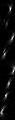

# kmeans-kernels
Convolutional kernels learned by k-means

The network is a single convolutional layer + a fully connected layer on top. For evaluation the convolutional layer weights are (1) initialized randomly, (2) learned through back-propogation and (3) learned by k-means.

Inspired by http://ai.stanford.edu/~ang/papers/nipsdlufl10-AnalysisSingleLayerUnsupervisedFeatureLearning.pdf

Back-pro and k-means have similar performance for MNIST.

## 8 kernels, 3x3
traing type|train, %|test, %
---|---|---
random|98.22|94.79
back-pro|**100**|96.50
k-means|**100**|95.13

## 8 kernels, 5x5
traing type|train, %|test, %
---|---|---
random|98.36|94.63
back-pro|**100**|96.96
k-means|**100**|96.02

## 8 kernels, 7x7
traing type|train, %|test, %
---|---|---
random|98.37|94.58
back-pro|**100**|97.48
k-means|**100**|95.13

## 8 kernels, 11x11
traing type|train, %|test, %
---|---|---
random|97.70|93.78
back-pro|**100**|97.51
k-means|**99.98**|97.47

## 8 kernels, 15x15
traing type|train, %|test, %
---|---|---
random|97.29|93.63
back-pro|**100**|97.68
k-means|**99.96**|96.97
---

## 8 kernels (15x15) learned by back-pro

## 8 kernels (15x15) learned by k-means

