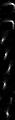

# kmeans-kernels
Convolutional kernels learned by k-means

The network is a single convolutional layer + a fully connected layer on top. For evaluation the convolutional layer weights are (1) initialized randomly, (2) learned through back-propogation and (3) learned by k-means.

Inspired by http://ai.stanford.edu/~ang/papers/nipsdlufl10-AnalysisSingleLayerUnsupervisedFeatureLearning.pdf

The results for MNIST.

8 kernels, 3x3
---
traing type|train, %|test, %
---|---|---
random|98.17|94.63
back-pro|98.99|95.62
k-means|**100**|95.02
---
8 kernels, 5x5
---|---|---
random|98.58|94.66
back-pro|98.10|94.25
k-means|**100**|95.47
---
8 kernels, 7x7
---|---|---
random|98.33|94.67
back-pro|98.15|94.25
k-means|**100**|96.99
---
8 kernels, 11x11
---|---|---
random|97.54|93.84
back-pro|97.70|94.11
k-means|**99.97**|97.26
---
8 kernels, 15x15
---|---|---
random|97.27|93.77
back-pro|97.38|93.87
k-means|**99.89**|96.52
---

